```{r setup, include=FALSE}
knitr::opts_chunk$set(echo = TRUE, eval = TRUE, message = FALSE, warning = FALSE)
```

# Conjoint Experiments

Today, we are going to be developing our own conjoint experimental design.^[A large proportion of this lab was adapted from code and materials from [Thomas Leeper](https://github.com/leeper/conjoint-example)] Conjoints are a great tool for conducting causal analysis given a large number of factorial levels in an experimental setting. 

A conjoint is a fully randomized, factorial experiment involving a potentially large number of factors and factor levels. Typically, participants are exposed to a vignette wherein features of the vignette (e.g., a person description) are randomized. To gain statistical power, within-subjects comparisons are typically leveraged. That is, a respondent may be exposed to 5-10 vignettes in order to multiple the statistical power of the design (under some plausible assumptions). Today, we will only expose "respondents" to one conjoint, but this code can be adapted in many ways to expose respondents to different vignettes!

Today, we will focus on a conjoint design where we randomize the attributes for two candidates, candidate A and candidate B, and see how these different attributes impact vote preference.

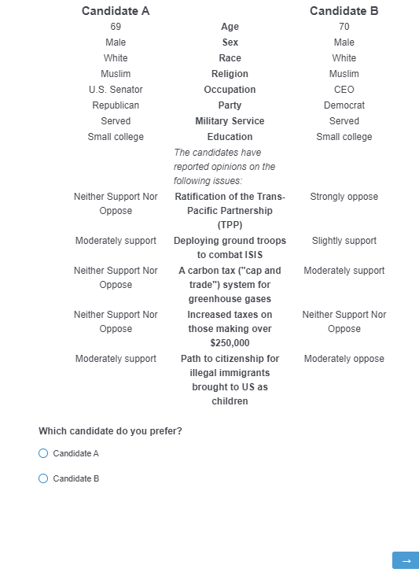

The data are analyzed using regression with respondent fixed effects (and/or standard errors clustered by respondent if using multiple observations per respondent) in order to estimate the marginal contribution of each feature (trait factor) averaging across all of the other combinations of feature levels. Because the other features are independent and should (in theory) be randomly assigned, we can focus just on the feature we are interested in when running the analysis.

One approach to doing this in Qualtrics would be creating individual questions for each combination of the factorial components. However, t  his design creates approximately 2.5 million experimental cells. So it is impossible to physically create every possible combination of candidate profiles. Thus to actually conduct this experiment requires some dynamic programming that generates the profiles randomly. Building on Dropp's techniques, I show how Thomas Leeper and Joshua Robison implemented this in Qualtrics.


The basic workflow that we will go through below is this:

1. Create a "template" HTML document that lays out the candidate profiles, without any of the feature information populated. Use this template as the body of a Qualtrics multiple choice question.

2. Write a small javascript (js) that randomly samples from all possible traits and save this as javascript in the Qualtrics question. The js script should also save the profile data to Qualtrics "embedded data" fields so that it the output data file contains a record of which profiles were shown to which respondents.

3. Repeat this for however many profiles are needed. We use 1 in this study, so that each respondent was shown one pair of candidates. Using multiple pairs would multiply our effective sample size (but ensure if you do this you account for whatever uncertainty is introduced by using non-independent observations).

4. Run the study, download the data, and construct profile-describing variables from stored profile information.


# Setting up a conjoint experiment on Qualtrics with Javascript

Qualtrics XM now comes with native support for conjoint experiments. If your organization supports this, then you can follow [this guide](https://www.qualtrics.com/support/conjoint-project/getting-started-conjoints/getting-started-choice-based/getting-started-with-conjoint-projects/) on how to set one up. However, UNC qualtrics does not have this feature enabled. In order to construct a conjoint, we are going to set up one with Javascript.

## Setup on Qualtrics

Let's begin by logging on to [UNC Qualtrics](https://software.sites.unc.edu/qualtrics/). Then, create a new project and make a blank survey:

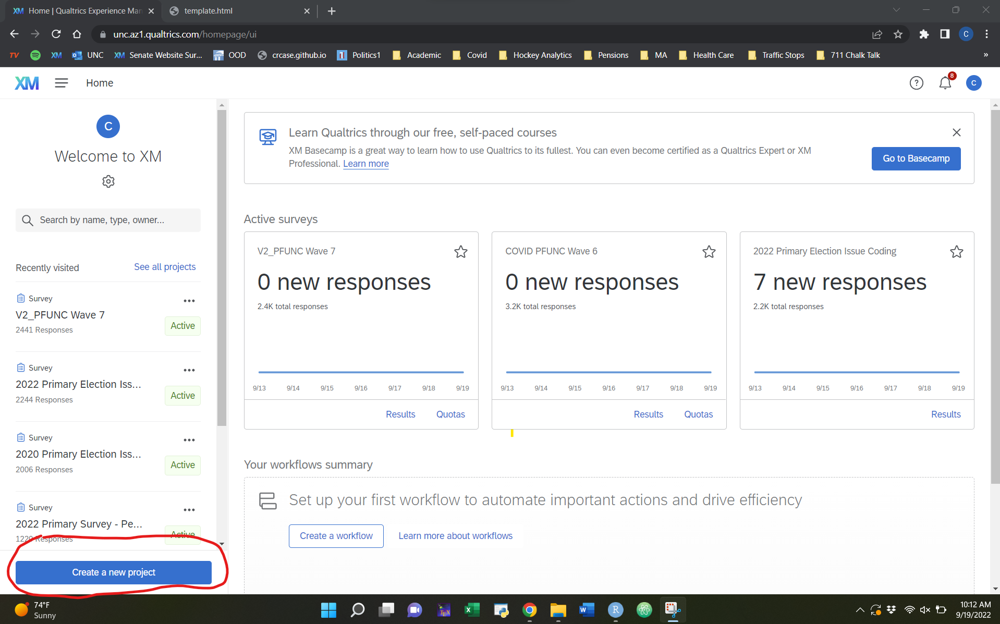
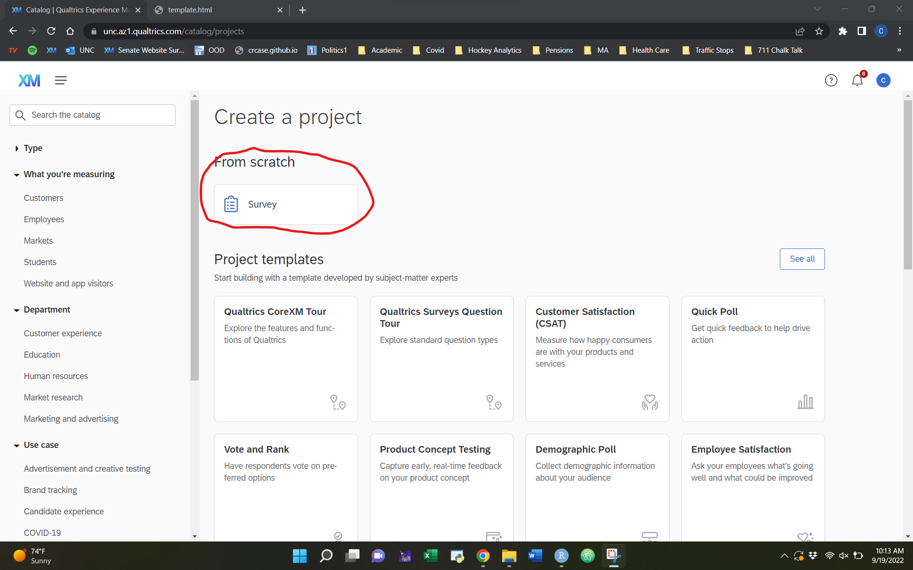

Now, head over to survey flow, and we will create two items there. The first is a Web Service. The second is setting embedding data.

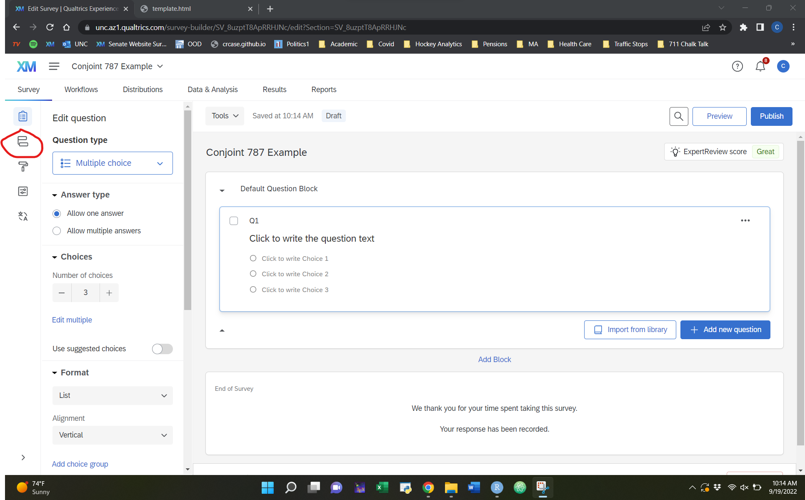

One concern with using javscript to randomly sample is that javascript is a client-side technology, so the randomizations are executed by the respondent's browser rather than the Qualtrics server. This introduces a potentially rare but important risk in the design. If a respondent refreshes their browser, all of this code is re-executed such that a different set of profile features are shown to the respondent. This poses real analytic and user-experience risks, so we need to find a way to ensure that the displayed profiles are unaffected by any refreshes or browser mishaps.

In many languages that would be easy to achieve with a seeded pseudo-random number generator, but javascript's PRNG is not seeded. Luckily, David Bau has written [seedrandom.js](https://github.com/davidbau/seedrandom/) to achieve this with a full working example of how to do this for multiple profiles. 

 
To do this, we need to create what are called PRNG seeds for each combination of profiles we are interested in testing. To do this, we need to create the random draw routine using the Web Service. Use `http://reporting.qualtrics.com/projects/randomNumGen.php` as the URL and the `GET` method. Then, set some query parameters:
`min` - The minimum ID of conjoint draws
`max` - The maximum ID of conjoint draws

So if you are going to randomize 10 times in the conjoints, you will set `min` to 0 and `max` to 9. For our project, we have a high number of randomizations, so we want to set the max to 99999999999.

In "Set Embedded Data", using `seed1` as the field name and `random` as the field value. You will need to setup one of these "Web Service" entries for each conjoint profile, saving the seed as a unique embedded data field. So, if you have five conjoint profiles to display, you will need to setup five Web Service entries and five corresponding embedded data seed fields (`seed1`, `seed2`, `seed3`, `seed4`, `seed5`) that will be populated by the web service calls and retrieved via the javascript. The randomseed.js code will then be added to each conjoint profile question's javascript field, grabbing the right embedded data seed using the Qualtrics ${e://Field/EMBEDDEDDATAFIELD} notation to set the seed for that profile page:


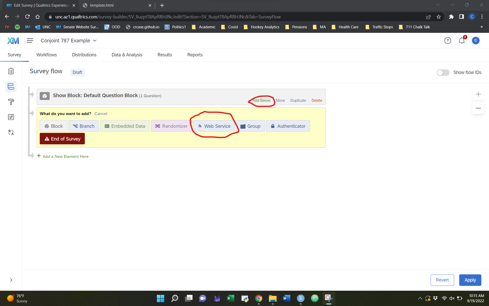


Next, create a "Set Embedded Data" instance. Enter `traits1a` and leave the value blank. Do the same for `traits1b`. This will instruct Qualtrics to set aside two columns, `traits1a` to store the a list of traits for candidate A and `traits1b` to store the list of traits for candidate B.


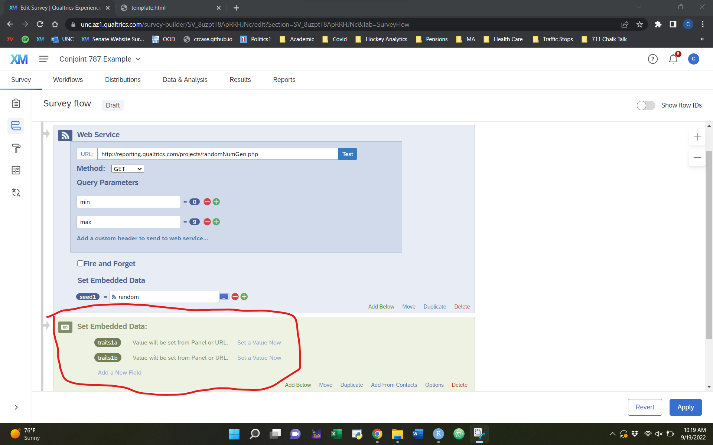

Next thing is to go to the "Look and Feel" tab. Go to Theme, then Motion. Make sure Page Transition is set to `None`. This is usually the default but it is good to check!

When you are done, head back to the main dashboard.


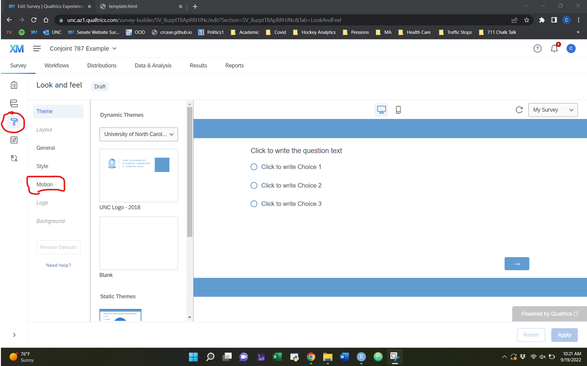


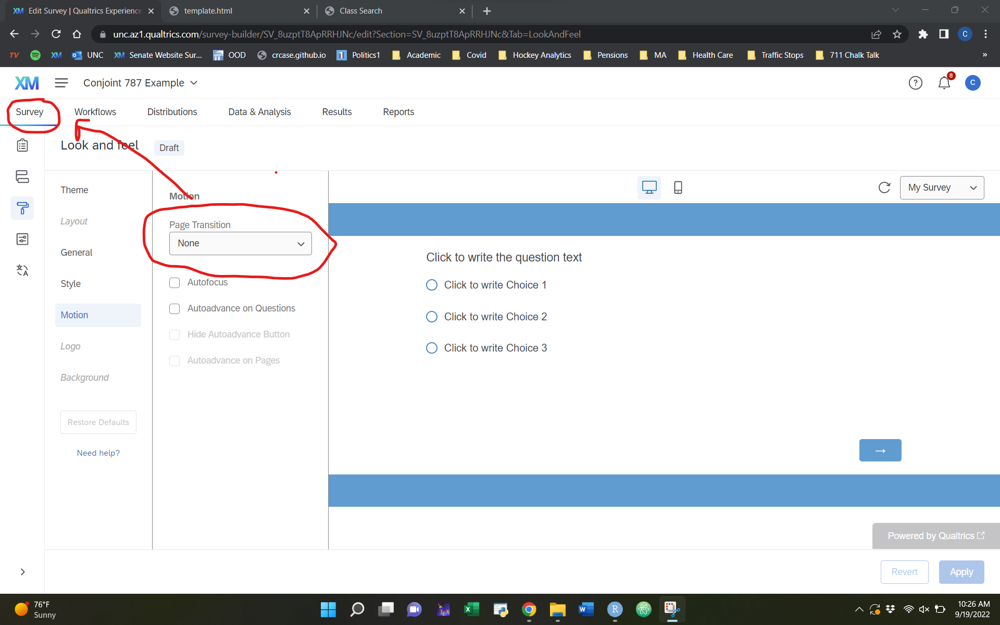


## Writing the Conjoint Question


At the place where you want to place your experiment, choose question type `Multiple Choice`, then click on the question text. A few buttons would appear. Click on `Rich Content Editor`.

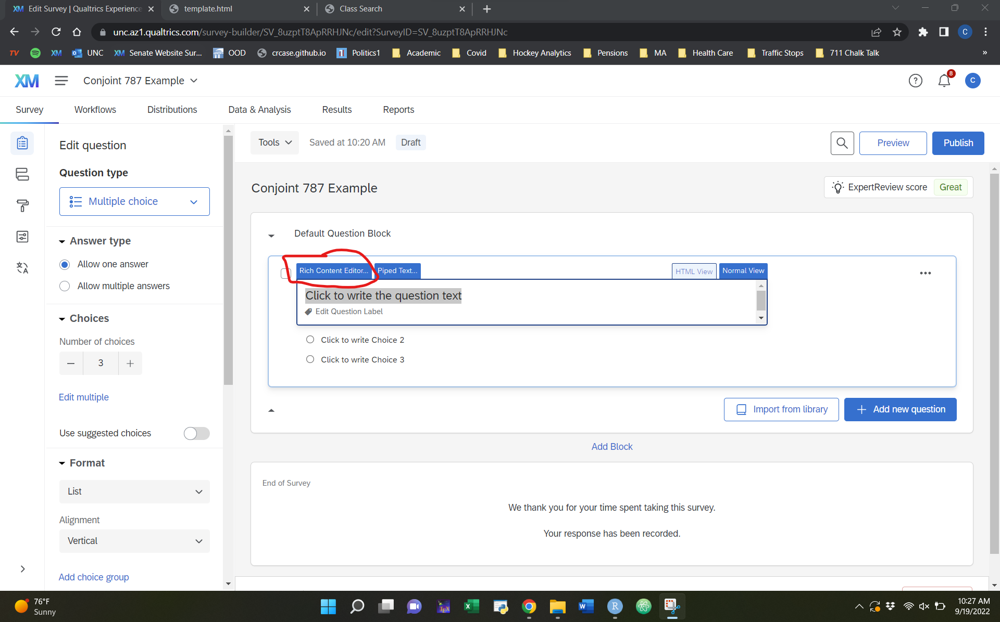

Click on the script button (<> on a page), and paste the contents of `template.html` in there. You can copy the HTML code by opening template.html with a plain text editor, like notepad on Windows or TextEdit on Mac.


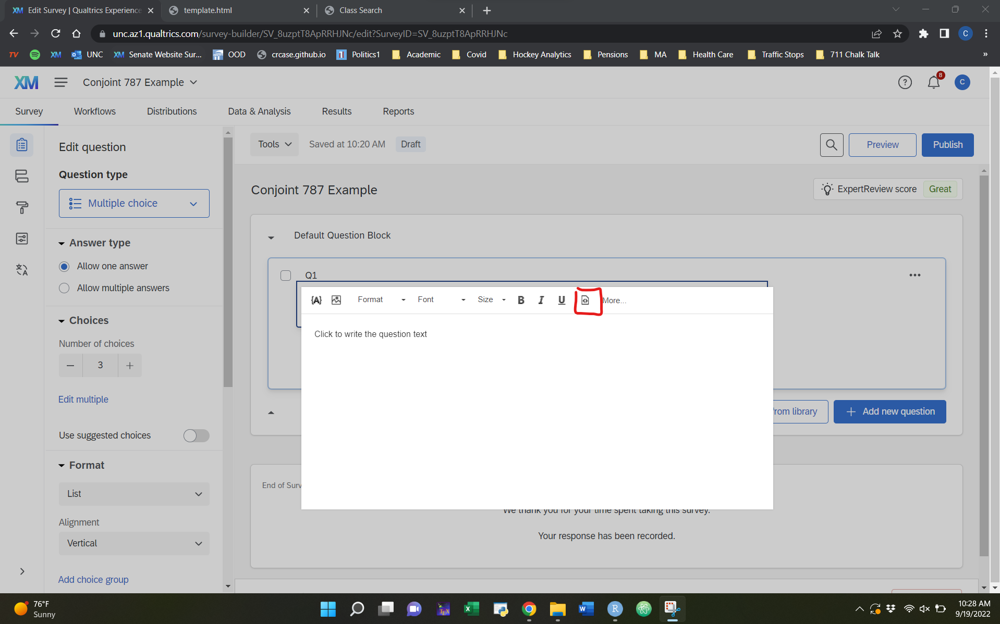


Now that we have the table structure included, we need to write the js to actually randomize for candidates. To do this, select the same question, navigate to the bottom of the `Edit Question` tab, click on `Javascript`:

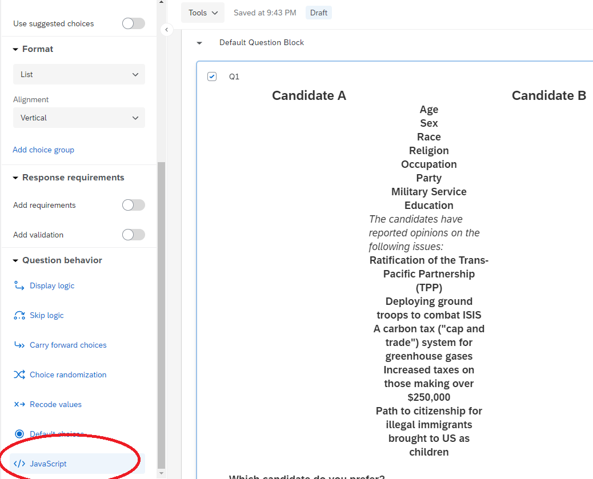

## Editing the Conjoint Script

Now let's edit our conjoint script and paste it in here. The following walks through each step, but all of this goes in the broader javascript. The following code chunks should be copy and pasted into the rich text editor in order.

The javascript code needs to do four things: (a) define all of the possible feature values, (b) randomly sample from those values, (c) display them to the respondent, and (d) save the sampled values for later use in analysis.

### Controlling Randomization

First, we need to randomize using our controlled procedure we laid out above. To do this, we will first include code to import seeded random number generator. We then seed the random number for our first profile field. The code is as follows:

```
// import seeded random number generator code

!function(a,b){function c(c,j,k){var n=[];j=1==j?{entropy:!0}:j||{};var s=g(f(j.entropy?[c,i(a)]:null==c?h():c,3),n),t=new d(n),u=function(){for(var a=t.g(m),b=p,c=0;q>a;)a=(a+c)*l,b*=l,c=t.g(1);for(;a>=r;)a/=2,b/=2,c>>>=1;return(a+c)/b};return u.int32=function(){return 0|t.g(4)},u.quick=function(){return t.g(4)/4294967296},u["double"]=u,g(i(t.S),a),(j.pass||k||function(a,c,d,f){return f&&(f.S&&e(f,t),a.state=function(){return e(t,{})}),d?(b[o]=a,c):a})(u,s,"global"in j?j.global:this==b,j.state)}function d(a){var b,c=a.length,d=this,e=0,f=d.i=d.j=0,g=d.S=[];for(c||(a=[c++]);l>e;)g[e]=e++;for(e=0;l>e;e++)g[e]=g[f=s&f+a[e%c]+(b=g[e])],g[f]=b;(d.g=function(a){for(var b,c=0,e=d.i,f=d.j,g=d.S;a--;)b=g[e=s&e+1],c=c*l+g[s&(g[e]=g[f=s&f+b])+(g[f]=b)];return d.i=e,d.j=f,c})(l)}function e(a,b){return b.i=a.i,b.j=a.j,b.S=a.S.slice(),b}function f(a,b){var c,d=[],e=typeof a;if(b&&"object"==e)for(c in a)try{d.push(f(a[c],b-1))}catch(g){}return d.length?d:"string"==e?a:a+"\0"}function g(a,b){for(var c,d=a+"",e=0;e<d.length;)b[s&e]=s&(c^=19*b[s&e])+d.charCodeAt(e++);return i(b)}function h(){try{if(j)return i(j.randomBytes(l));var b=new Uint8Array(l);return(k.crypto||k.msCrypto).getRandomValues(b),i(b)}catch(c){var d=k.navigator,e=d&&d.plugins;return[+new Date,k,e,k.screen,i(a)]}}function i(a){return String.fromCharCode.apply(0,a)}var j,k=this,l=256,m=6,n=52,o="random",p=b.pow(l,m),q=b.pow(2,n),r=2*q,s=l-1;if(b["seed"+o]=c,g(b.random(),a),"object"==typeof module&&module.exports){module.exports=c;try{j=require("crypto")}catch(t){}}else"function"==typeof define&&define.amd&&define(function(){return c})}([],Math);

// seed random number generator from embedded data fields
// conjoint profile 1
Math.seedrandom('${e://Field/seed1}');
```

If you had additional conjoint profiles, you could continue to add code below the first profile that references a different seed.


### Create Variables Associated With Each Dimension

The next step is defining feature values and sampling from them. For discrete features, this is pretty simple. You just create a javascript array containing all the values and draw a random value from the array. We also added three additional complexities:

1. One of our features, age, was continuous so we simply randomly sample numbers in a given range (35-75).

2. We constrained another feature, party, to always display one Democrat and one Republican, so the code for this is a bit different.

3. We constrained two other features (race and religion) to use unequal sampling probabilities. This was to prevent huge numbers of "rare" profiles from appearing (i.e. we should expect more of our candidates to be white than simple randomization would allow).

The code for the "simple" features is straightforward because we simply define arrays with all possible feature values:

```
// Create Variables for Traits associated with each dimension.
var vsex = ["Male", "Female"];
var voccupation = ["State Governor", "U.S. Senator", "Member of Congress", "CEO"];
var vmilitary = ["Served", "Did not serve"];
var veduc = ["Community college", "State university", "Small college", "Ivy League university"];
var vopinion = ["Strongly oppose", "Moderately oppose", "Slightly oppose", "Neither Support Nor Oppose", "Slightly support", "Moderately support", "Strongly support"];
```

For the party code, we run a simple if else logic. This code is as follows:

```
if (Math.random() >= 0.5) {
    var vparty = ["Republican", "Democrat"];
} else {
    var vparty = ["Democrat", "Republican"];
}
```

For the unequal sampling, we will also use if-else statements. These statements will draw a random number (0 to 100) and then assign it based on certain specified probabilities. In other words, if the number falls in a certain range, we will assign specific categories based on the range set. Note, javascript, as well as python, are what we refer to as "zero indexed languages", so when we extract values out of the array, `var out = 0` will return the first item in the list.


```
// Functions for setting race and religion approximately proportionately
function getRace(){
  // 60% non-hispanic white; 15% black; 15% hispanic; 10% asian
  var n = Math.floor(Math.random()*100);
  if (n<10) {
    var out = 3;
  } else if (n <25) {
    var out = 2;
  } else if (n<40) {
    var out = 1;
  } else {
    var out = 0;
  }
  var vrace = ["White", "African American", "Hispanic", "Asian American"];
  return vrace[out];
}
function getReligion(){
  // 20% evangelical; 20% mainline; 20% catholic; 10% jewish; 10% muslim; 20% none
  var n = Math.floor(Math.random()*100);
  if (n<20) {
    var out = 5;
  } else if (n<30) {
    var out = 4;
  } else if (n<40) {
    var out = 3;
  } else if (n<60) {
    var out = 2;
  } else if (n<80) {
    var out = 1;
  } else {
    var out = 0;
  }
  var vreligion = ["Evangelical protestant", "Mainline protestant", "Catholic", "Jewish", "Muslim", "None"];
  return vreligion[out];
}

```

We then put all of this together to make our candidate combinations that are randomly assigned. Note, the first portion of this is a random draw on a continuous range to get age. Also note, this is in order of the table that we created in the question above.

```
// Use math.random to randomly select traits for each dimension for candidate A
traits_a = [(Math.floor(Math.random() * (75 - 35 + 1)) + 35).toString(),
            vsex[Math.floor(Math.random()*vsex.length)],
            getRace(),
            getReligion(),
            voccupation[Math.floor(Math.random()*voccupation.length)],
            vparty[0],
            vmilitary[Math.floor(Math.random()*vmilitary.length)],
            veduc[Math.floor(Math.random()*veduc.length)],
            vopinion[Math.floor(Math.random()*vopinion.length)],
            vopinion[Math.floor(Math.random()*vopinion.length)],
            vopinion[Math.floor(Math.random()*vopinion.length)],
            vopinion[Math.floor(Math.random()*vopinion.length)],
            vopinion[Math.floor(Math.random()*vopinion.length)] ];

// Use math.random to randomly select traits for each dimension for candidate B
traits_b = [(Math.floor(Math.random() * (75 - 35 + 1)) + 35).toString(),
            vsex[Math.floor(Math.random()*vsex.length)],
            getRace(),
            getReligion(),
            voccupation[Math.floor(Math.random()*voccupation.length)],
            vparty[1],
            vmilitary[Math.floor(Math.random()*vmilitary.length)],
            veduc[Math.floor(Math.random()*veduc.length)],
            vopinion[Math.floor(Math.random()*vopinion.length)],
            vopinion[Math.floor(Math.random()*vopinion.length)],
            vopinion[Math.floor(Math.random()*vopinion.length)],
            vopinion[Math.floor(Math.random()*vopinion.length)],
            vopinion[Math.floor(Math.random()*vopinion.length)] ];


```


### Creating Arrays in Question Text

Now, with the seeds configured and used to seed the PRNGs, and the feature values randomly sampled, we can now use the Qualtrics Javascript API to Question API to modify the displayed question text and store the displayed values as a further embedded data field.

Our javascript code includes two arrays that store the html id's for each attribute value:

```
// Create list of variables to use when setting attributes
a_list = ["a1","a2","a3","a4","a5","a6","a7","a8","a9","a10","a11","a12","a13"]; 
b_list = ["b1","b2","b3","b4","b5","b6","b7","b8","b9","b10","b11","b12","b13"]; 

```


We then loop over these (a loop from 0 to 12, given javascript's base 0 indexing), and set the "innerHTML" of html element a_list[i] ("a1", "a2", etc.) and b_list[i] ("b1", "b2", etc.) to the value of the traits in traits_a[i] and traits_b[i], respectively.

```
// set html values in conjoint table
for(i=0;i<13;i++){
    document.getElementById(a_list[i]).innerHTML = traits_a[i];
    document.getElementById(b_list[i]).innerHTML = traits_b[i];
}
```

Then, we need to save the displayed traits in embedded data fields so that we can access them later. This requires first defining the embedded data fields in the Qualtrics editor, leaving the values blank. We created one embedded data field for each candidate in each profile pair. The code traits_a.join("|") binds the values of the trait arrays into a single pipe-separated character string and the Qualtrics.SurveyEngine.setEmbeddedData() function stores that string in the named embedded data field. 


```
// store values as embedded data fields
Qualtrics.SurveyEngine.setEmbeddedData('traits1a', traits_a.join("|"));
Qualtrics.SurveyEngine.setEmbeddedData('traits1b', traits_b.join("|"));

```


And Voila! You've just created a conjoint experiment on Qualtrics with Javascript for free! Make sure to edit the question response, and then go click "preview survey" to see how the randomization looks/if it worked or not.

For your lab submission, please turn in a link to the published survey.


