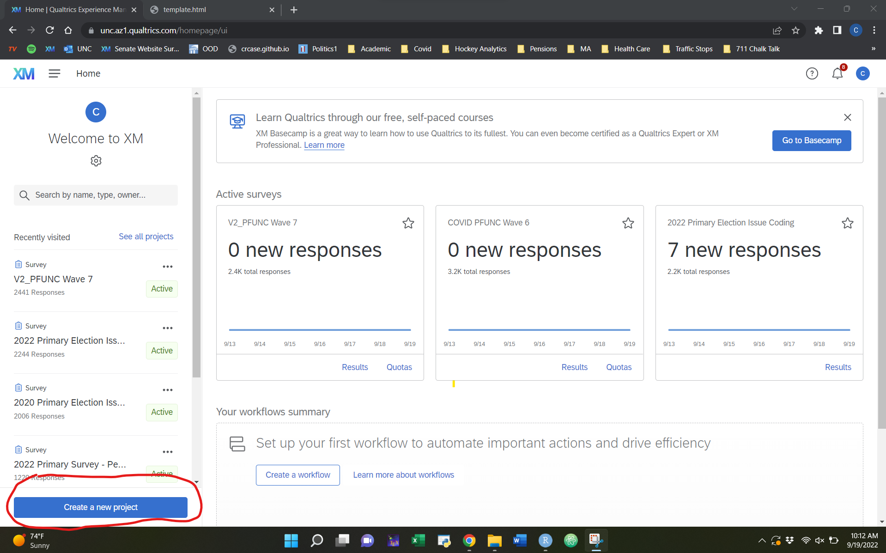
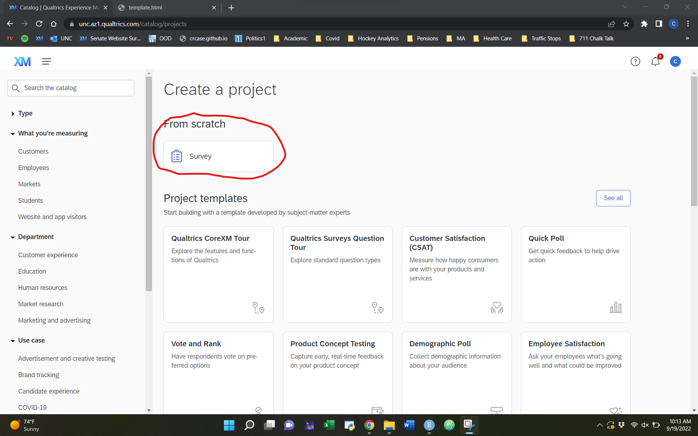
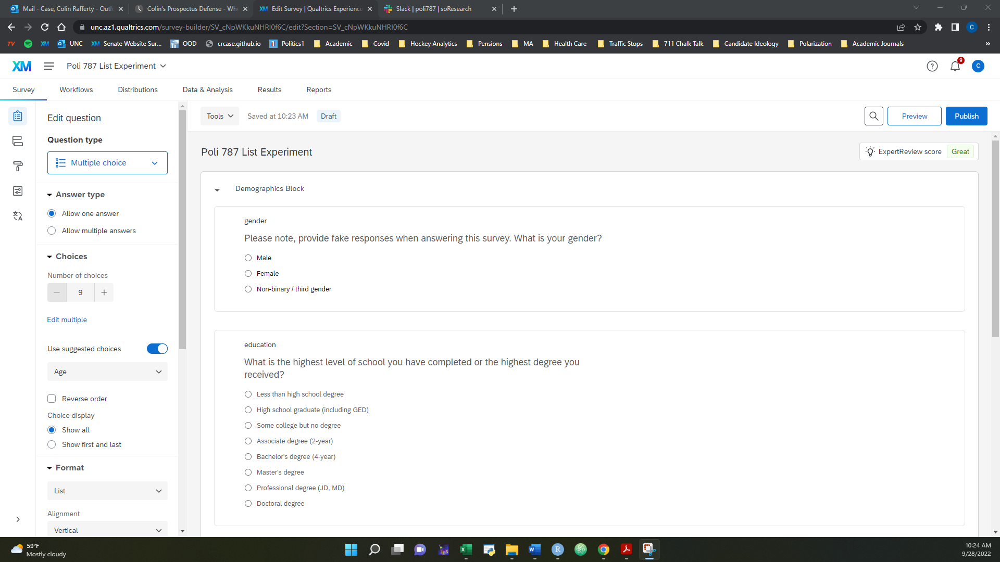
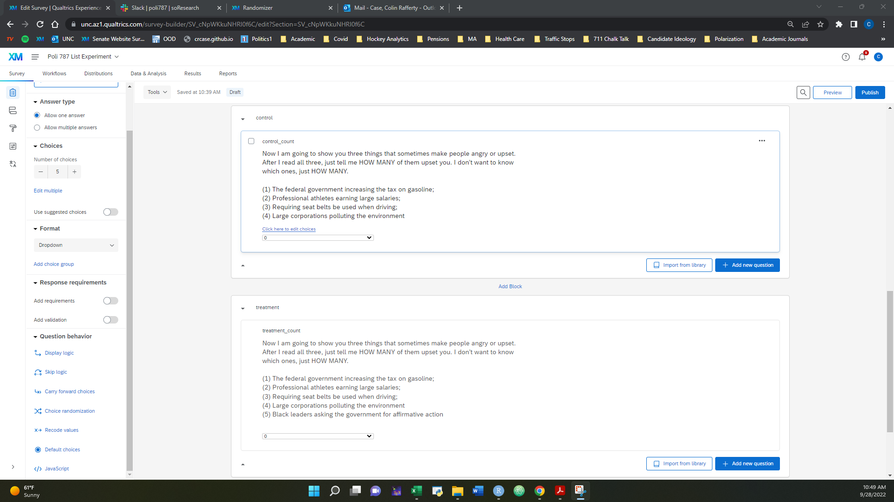
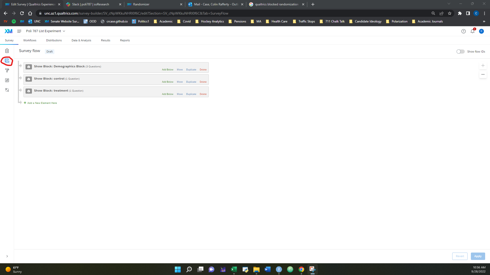
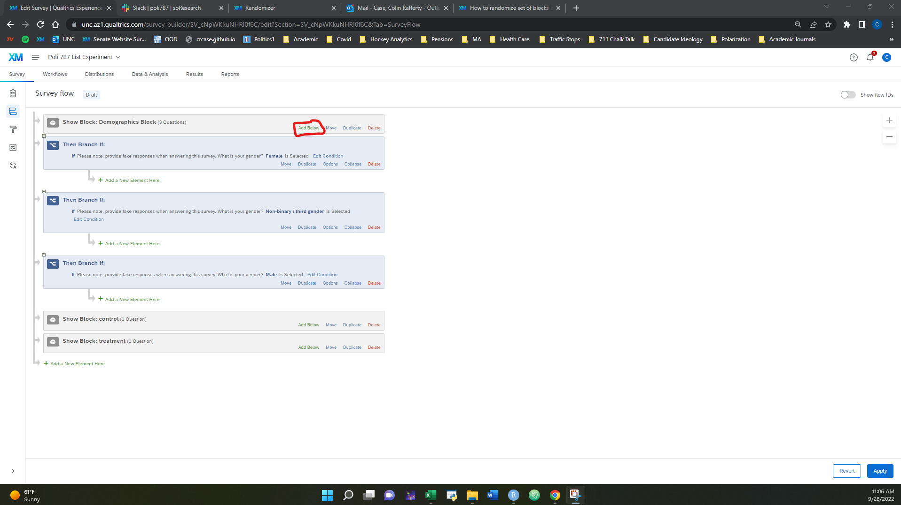
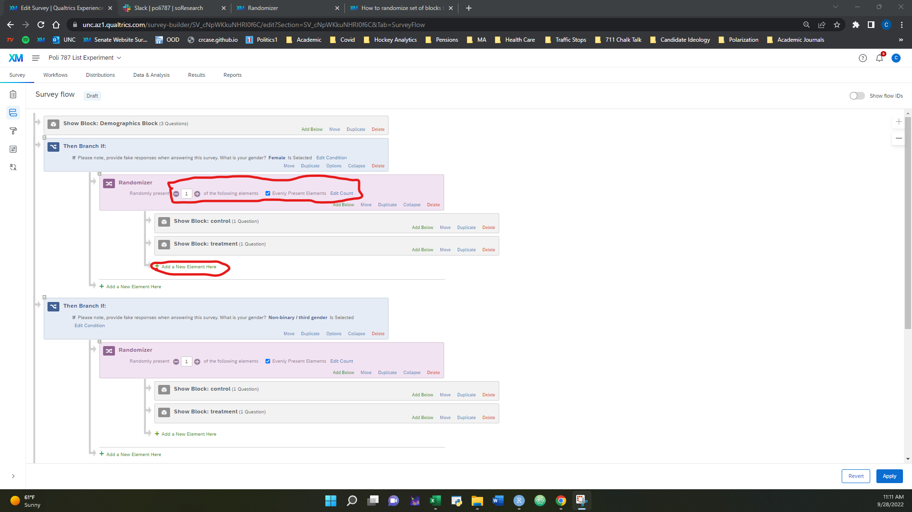
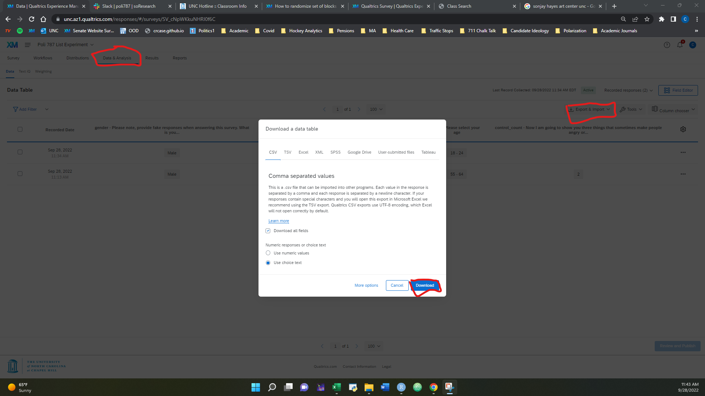

```{r setup, include=FALSE}
knitr::opts_chunk$set(echo = TRUE, eval = TRUE, message = FALSE, warning = FALSE)
```

# List Experiments

Today, we are going to be developing your own list experiment. List experiments are beneficial for eliciting truthful comments on sensitive items (i.e. items where there is a strong social desirability bias or likelihood of lying). List experiments work by asking respondents how many elements of a list they feel either positively or negatively towards (depending on your research question) *without* asking about feelings towards specific items. To understand feelings towards the specific item, you will create two lists: one without sensitive items, and one with the same items as the first list plus the sensitive item. Respondents will then be randomly assigned to one of the lists or the other. We can then calculate respondents' feelings towards the sensitive item by calculating the difference of means between those who received the list and those who did not.  See [this review](https://imai.princeton.edu/research/files/listExamples.pdf) of list experiments to get a sense of how these experiments are constructed.

In this lab, you are going to come up with a question you would like to ask (ideally related to your research).

# Qualtrics Survey


Let's begin the same as last week by logging on to [UNC Qualtrics](https://software.sites.unc.edu/qualtrics/). Then, create a new project and make a blank survey:




We are first going to create a block with three general demographic questions. Please note, we will be having your classmates (and myself) fill this out, but you should specify that respondents should provide fake demographic data due to our small class (I will fill this out multiple time as well, so you have a little bit more data)! Make sure one of the questions asks about respondents' gender and provides the response options of "Male," "Female," and "Non-binary/third gender." We are going to include a blocked design on this question so you can see how this works in practice.

It is good practice to label your blocks and questions. When you download the data, the question labels will be your variable names in R. After you finish adding the three questions, your survey design should look something like this:




## List Experiment

We are now going to move on to creating the list experiment. To do this, first create two survey blocks in your questionnaire. One should be labeled control and the other should be labeled treatment. For each, write the same question with the same list of control items in the list. Your treatment condition should have one additional item. After doing this, your survey questions should look something like this:





Because we only have two survey conditions, we are going to use a more straightforward way than last week to randomize our experiment. First, return to the survey flow. Your screen should look something like this:




Click "Add Below" on the demographics block, and then select "Branch." We are going to create three of these instances: one for each possible response to the gender question. To do this, select "Add a condition," select the gender question, and select the first response. Repeat these steps twice for each gender response. Your screen should look something like this:



Under each branch, we are then going to add an instance of a "Randomizer" by clicking "Add a new element here." Then, add in the questions below the randomizer by again selecting "Add a new element here," (make sure this is the indented option AFTER the randomizer) click block, and select the control and treatment blocks. Your survey flow should look like this after your done (you should also remove the blocks below so they only show up in the randomizer component). Make sure you specify that only 1 of the following elements should appear! Once your survey looks like this, you can click apply, and go see how your survey looks in the preview back on the main survey flow.





# Analyzing Qualtrics Data

After your survey looks good in the preview, select "Publish." You should see a link to share the survey. Select this link, and copy it to the discussion board on Canvas set up for this lab. Also, let me know as I will take your survey multiple times so you can check the data and the randomization procedure.


Once everyone has taken eachothers surveys and you have at least 10 responses, we are going to download the data. To do this, select "Data and Analysis" on the top bar, "Export and Import," and export as a CSV.



# Exercise

For today's exercise, I want you to take the survey data and conduct the following tests (keep in mind people are answering randomly, so the treatment effect shouldn't bear out at all):

1. A two by two table of the gender responses and treatment conditions to check that the blocked randomization worked properly.

2. Perform a linear regression on the count variable (you will have to merge these into the same variable) with treatment status as an independent variable.

Submit the results of your analysis in an R-markdown file.


