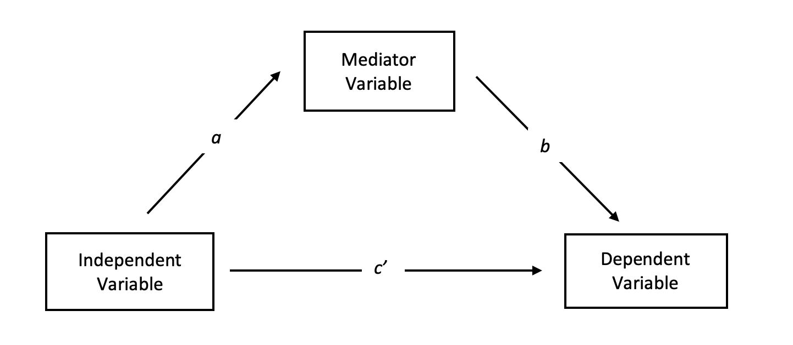

```{r setup, include=FALSE}
knitr::opts_chunk$set(echo = TRUE, eval = TRUE, message = FALSE, warning = FALSE)
```

# Mediation Analysis

In many scientific disciplines, the goal of researchers is not only estimating causal effects of a treatment but also understanding the process in which the treatment causally affects the outcome. This is known as a mediated effect. It occurs when the independent variable's effect on the dependent variable is — as the name says — mediated by another variable: A mediator. The DAG of a mediating variable can be seen below:



As you can see, there are three direct quantities of interest we want to calculate. 

$c$: The effect of the independent variable on the dependent variable. When not controlling for the mediator variable, this is called the total effect. We are subsequently interested in $c'$, or the direct effect of the independent variable on the dependent variable *after* we control for the mediator.

$a$: The effect of the independent variable on the mediator. For a variable to be a mediator, there must be a relationship between the independent variable and the mediator variable. That is to say, the mediator must be endogenous. 

$b$: The effect of the mediator on the dependent variable while controlling for the main independent variable.


To conduct this analysis, we'll be using the `mediation` package which has a nice vignette, from which the code for this section is adapted. We’ll be working with framing dataset within the mediation package. This is taken from a 2008 AJPS article. In short, the authors randomly selected a vignette on immigration to show subjects, after which they measured their attitudes and behavior with respect to immigration.

The proposed mediator here is a measure of anxiety (emo), which we will model as a result of the frame and the subject covariates. The outcome we’re interested in is whether or not the subject expressed willingness to write a letter about immigration to their Congressperson (cong_mesg).


Let's start with the total direct effect without including the mediator. Basically, we want to understand whether there is a relationship between the two variables. Note: throughout the lab, make sure you are controlling for `age`, `gender`, `educ` and `income`. 

```{r}
# Clear Environment
rm(list = ls())
# Set seed 
set.seed(1996)
# Load Packages
library(mediation)
library(haven)
library(lme4)
library(tidyverse)
# Load framing data
data(framing)

# Estimate Total Effect
m1 <- lm(cong_mesg ~ treat + age + educ + gender +income, data = framing)
summary(m1)
```


As you can see, our treatment approaches statistically significance, but the total effect is not statistically significant. This is okay -- although somewhat debated, a significant effect does not need to exist for a mediation to be able to occur. 

Next, let's turn to the effect of the IV on the mediator. To establish a mediator, this relationship must significantly affect the mediator. Otherwise, we are only considering a direct effect of our mediating variable, `emo`. To do this, we are going to run a simple linear regression of the independent variable and the same controls on the mediator.

```{r}
# Effect of IV on Mediator
m2 <- lm(emo ~ treat + age + educ + gender + income, data = framing)
summary(m2)
```

As you can see, the independent variable does affect the mediator.

The final portion we need to confirm is that the mediator affects the dependent variable while controlling for the independent variable. This means, that for a mediation to take place, the mediator must explain more or other parts of the variance in the dependent variable than the independent variable.


```{r}
# Effect of the mediator on the DV
m3 <- lm(cong_mesg ~ emo + treat + age +educ + gender + income, 
                  data=framing) 
summary(m3)
```

A couple things to note. First, the mediator has a significant effect ($p<.05$) on the dv. With the result from above, we can now already say that there is a mediation. Second, we can see the effect of the treatment has been reduced in magnitude, and is nowhere close to statistical significance now. In a case such as this, we would consider this a complete mediation because the effect of the IV on the DV is explained by the mediator. This is why mediation analysis is useful -- it helps us understand the process of the effect of the IV onto the DV better.


## The `mediate()` function

We now want to calculate the entire model as one so we can get out a few additional quantities of interest. To do this, we are going to use the `mediation` package which automatically completes the process we did above.

The mediate function takes 5 required arguments:

- `model.m`: the mediator model (second model above)
- `model.y`: the outcome model (third model above)
- `treat`: a string, specifying the name of the treatment variable (`treat`)
- `mediator`: a string, specifying the name of the mediator variable (`emo`)
- `sims`: the number of simulations used to generate uncertainty estimates

By default, mediate() uses pseudo-Bayesian Monte Carlo simulation, but there is an option to use the bootstrap instead.

Use the mediate package below, and summarize the output. Use 300 sims.

```{r}
# Specify mediation analysis
m4 <- mediate(m2, m3, treat = "treat", mediator = "emo", sims= 300);
summary(m4)
```

Let’s take a look at those results and try to interpret them. We have four primary quantities of interest:

1) ACME, or average causal mediation effect: This is the indirect effect of the IV on the DV that goes through the mediator.

2) ADE, or average direct effect: This is the direct effect of the IV on the DV.

3) Total Effect: This is the effect (direct + indirect) of the IV onto the DV.

4) Prop. Mediated: This is the proportion of the effect of the IV on the DV that goes through the mediator.

Let's see how each of these are calculated using our model from above  (Note: these values are going to be slightly off because of the simulation, but were you to increase the number of simulations, we would see the values converge):

```{r}
# ACME (Effect of treatment on mediator*effect of mediator on outcome)
m2$coefficients['treat']*m3$coefficients['emo']
# ADE (Effect of treatment on outcome while controlling for mediator)
m3$coefficients['treat']
# Total Effect (Effect of treatment on outcome without mediator)
m1$coefficients['treat']
# Prop. Mediated (ACME/Total Effect)
m2$coefficients['treat']*m3$coefficients['emo']/m1$coefficients['treat']
```
As you can see, we don't necessarily need the `mediate` package to get these values, but it does give us credible intervals and is easier to use.

Going back to the above table, let’s try to interpret those results: the ACME estimate is significant, while the ADE estimate is not. From this, we can conclude that the frame primarily acts through the mediator (the respondent’s level of anxiety) to effect the response, having no identifiable direct effect. This is more or less the same as what we saw above in our initial models. So, it’s not that the frame alone causes the outcome, but the way the frame is interpreted vis-a-vis a subject’s emotional state.

We can also display these effects visually:

```{r}
# Plot mediation model results
plot(m4)
```


`mediator` also allows you to moderate your mediator variable; i.e. interact it with another variable. For example, we might suspect that age interacts with emotional state to produce the outcome. Using the covariates argument, we can pass a named list to specify a moderator and levels, i.e. you should pass the name of the variable (unquoted) and a value, and the function will estimate the mediation effect given that value, i.e. holding it constant.

Try the same analysis as above, but set breakpoints at 30 and 60 years old. Summarize and plot the two sets of results. Are they different?

```{r}
# Using a moderator on the mediator

# Use covariates argument for age = 30
med_res30 <- mediate(m2, m3, treat = "treat", mediator = "emo", 
                     sims= 300, covariates = list('age',30)) 
# See model output
summary(med_res30)
# Plot model effects
plot(med_res30)

# Use covariates argument for age = 60
med_res60 <- mediate(m2, m3, treat = "treat", mediator = "emo", 
                     sims= 300, covariates = list('age',60))
# See model output
summary(med_res60)
# Plot model effects
plot(med_res60)
```

This doesn’t give you an estimate of the effect of the covariates on the mediator, but does make the mediation conditional on these values. Let your theory inform you on whether and how to do this. 


## Sensitivity Analysis

Mediation analysis requires a strong assumption of sequential ignorability. While this assumption is largely untestable, we can use sensitivity analysis to determine how sensitive our results are to violations of this assumption. The mediation package also has a function for this, `medsens`. The function works by varying $\rho$, which is the correlation between the residuals of the mediator model and the outcome regression. Recall that in a model, we are assuming $\rho$ to be zero.

Let’s see how sensitive our indirect (mediation) effect is to this assumption. Use the `medsens` function and the documentation to run, summarize, and plot this sensitivity analysis. The default value for varying ρ is fine, but use 300 sims again.

```{r}
# Sensitivity analysis for indirect effects
sens.indirect <- medsens(m4, sims= 300, effect.type= "indirect") 
summary(sens.indirect)
plot(sens.indirect)

# Sensitivity analysis for direct effects
sens.direct <- medsens(m4, sims= 300, effect.type= "direct") 
summary(sens.direct)
plot(sens.direct)

```

# Exercise: Motivated Reasoning/ Skepticism in Political Information Processing

How do people choose what information to consume? Which media outlet to use when looking for political information? It turns out humans are more likely to select things that they prefer or are familiar with. People tend to choose information that illustrates the same or similar issue predispositions. This phenomenon is also known as motivated reasoning.

In the exercise, you are going to work with experimental data collected from an information board experiment held in Germany. Respondents are presented with an information board and are asked to read the news articles presented on that board. Respondents are randomly assigned articles that report a particular German political party's stance on some political issues. These issue positions for a particular party can vary, from -3 (highly incongruent with the party's stereotypical position) and +3 (highly congruent). Respondents are allowed to randomly choose articles to read from, and are asked to rate their preference for the mentioned political party on a scale of 5, from 0 (lowest ranking) to 4 (highest ranking). They are also asked to complete a quiz testing their political sophistication, and the outcome score is captured in `know`.

The dependent variable is the mean-centered time taken for a participant to read an article. In the literature, people argue that people with more political knowledge are more likely to spend time digesting political information. However, we should pay attention to the role of motivated reasoning in this relationship. Some scholars argue that the highly sophisticated person would only spend more time reading an article on a party they already like. Otherwise they will just discard the article. On the other hand, some scholars argue these highly sophisticated readers may spend more time **counter-arguing** with things they don't like (motivated skepticism), so the average reading time for an article might increase if they have low preference rating for the party.

You will realize that we are essentially making a mediation argument here. If motivated reasoning is the causal mechanism behind information processing time, then the political sophistication of the person does not really matter without accounting for the person's affinity with a party. In other words, political sophistication can be conceived as the explanatory variable that might be correlated with the reading time for an article, but it is the respondent's reported party preference after reading the article that **mediates** this effect. 

In this exercise you are going to test if this mediation effect is present or not. This is possible in this experiment since `pref` is the result of reading a randomly assigned article. Use `time` as your dependent variable. `pref` is the person's rating of the mentioned party after reading the article; `know` is the political sophistication of the person. Control for `ipm1`, which is the randomly treated party-issue congruence score for a particular article. Do include a random intercept for `id`, since this is a repeated measures design for the respondents. Find the ACME for party rating. Does party rating mediate the effect of political sophistication on the average reading time of a particular article? Intepret the results - which hypothesis is supported? Motivated Reasoning or Motivated Skepticism?


```{r}
# Load data
ib <- read_dta('MLM3-IB.dta')

# Subset data to variables mentioned above and remove na's
ib_small <- ib %>% dplyr::select(pref, know, ipm1, time, id, art) %>% na.omit()

# Estimate mediator model with preference as DV, know, imp1 and random 
# intercept by respondent as IVs
ib.med.fit <- lmer(pref ~ know + ipm1 + (1|id), ib_small)

# Estimate the outcome model with time as DV, same controls as above, and pref as IV
ib.out.fit <- lmer(time ~ pref + know + ipm1 + (1|id),  ib_small)

# Use mediate to calculate mediated values
ib.med <- mediate(ib.med.fit, ib.out.fit, treat = "know", 
                  mediator = "pref", sims= 100)

```

```{r}
# Look at summary values 
summary(ib.med)

# Plot effects of mediation analysis
plot(ib.med)
```

From the plot above, we see that the motivated skepticism hypothesis is supported - highly sophisticiated readers are more likely to scrutinize information regarding a political party that they **dislike**. The ACME for this mediating relationship is significant at p<.05*, and the total effect is negative and also significant.

# Reference

